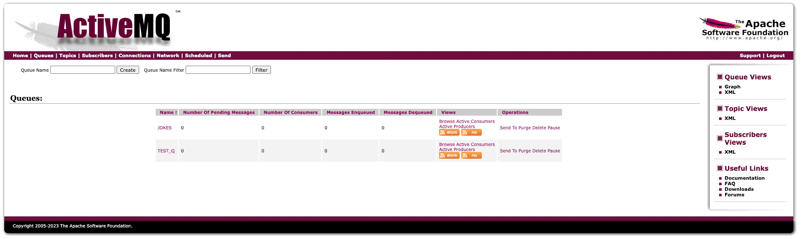

# OpenTelemetry | Spring Boot | Apache Camel

Here's a demo application that demonstrates how to hook up OpenTelemetry to an app that uses Apache Camel + Spring Boot.


## Get Started

### Pre-requisites 

This project was initially generated from [start.spring.io](https://start.spring.io). It uses Maven and Java 17, so ensure those are set up and available. 

[Docker & docker-compose](https://www.docker.com/get-started/) are used here as well so ensure those are available.

Grab a version of [opentelemetry javaagent](https://github.com/open-telemetry/opentelemetry-java-instrumentation/releases). Can use `./get_otel_javaagent.sh` to get the latest version as of this readme was created.

Within your IDE set environment variables for OpenTelemetry, and ActiveMQ.

```shell
# this is used to add the jar on the class path to auto instrument our application.
JAVA_TOOL_OPTIONS=-javaagent:${pwd}/otel-camel-demo/opentelemetry-javaagent.jar
# these are for where to sent traces.
OTEL_EXPORTER_OTLP_ENDPOINT=http://localhost:4317
OTEL_METRICS_EXPORTER=none
OTEL_SERVICE_NAME=otel-camel-demo
# amq variables
BROKER_URL=tcp://localhost:61616
QUEUE_NAME=activemq:queue:JOKES
```

Once that's set, start up the infrastructure

```shell
docker-compose up -d # that will start it up detached from your shell, remove `-d` to run in foreground
```

#### AMQ configuration

Let's create our queues....
Go to http://localhost:8161/admin/queues.jsp and create two queues
JOKES and TEST_Q.



Now that we have queues and our infra is up, you are ready to run the application and inspect spans. 

### Application

The application is fairly simple. It has an endpoint that you can call which returns a dad joke from another service I've created.
In addition, there is a timer checking the weather for the empire state building and logging it. 

The main idea is to showcase that you can auto instrument an application using opentelemetry and export them to a collector. That collector enables one to export to many different locations. We are using Jaeger to view them.


